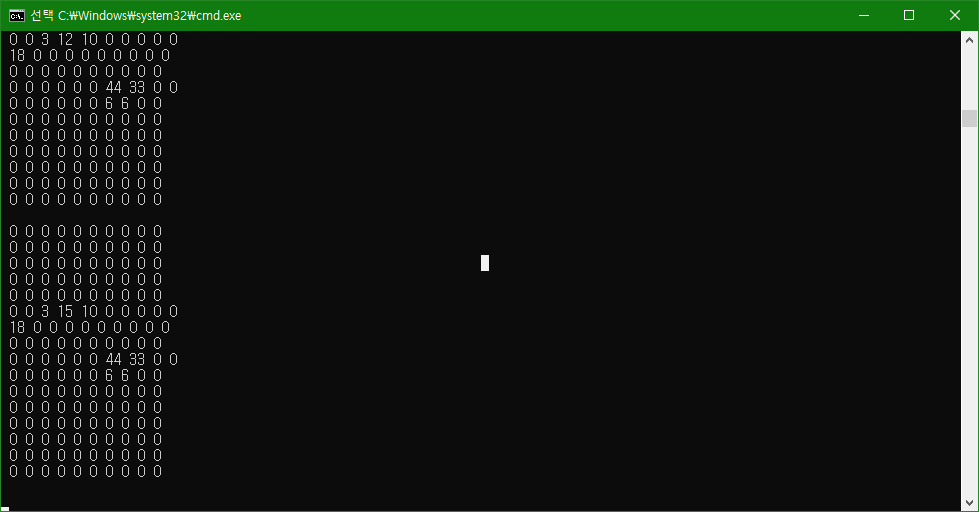

# klib2-python

Simple example of Processing API for Snowforce 3.

Max FPS(Frames per second) : 30

※The provided code is example code, and the performance may differ from actual results.

DEVELOPMENT ENVIRONMENT
-----------------------
* Python 3 https://www.python.org
* numpy https://numpy.org/install/
* Snowforce 3
   * https://github.com/kitronyx/snowforce3/blob/master/Snowforce3.0_2022.02.17.exe

QUICK START
-----------
* Download or clone source code
* Open and run `klib2-python.py`.
